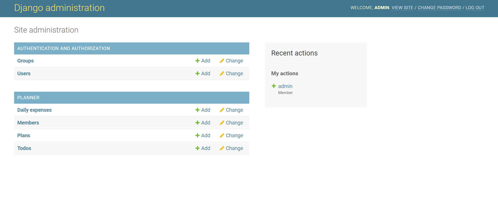
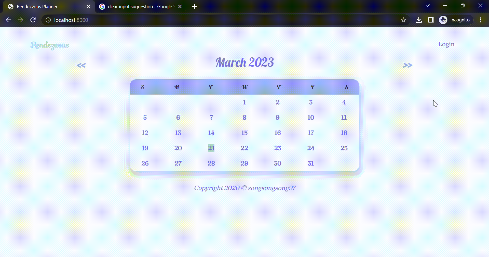
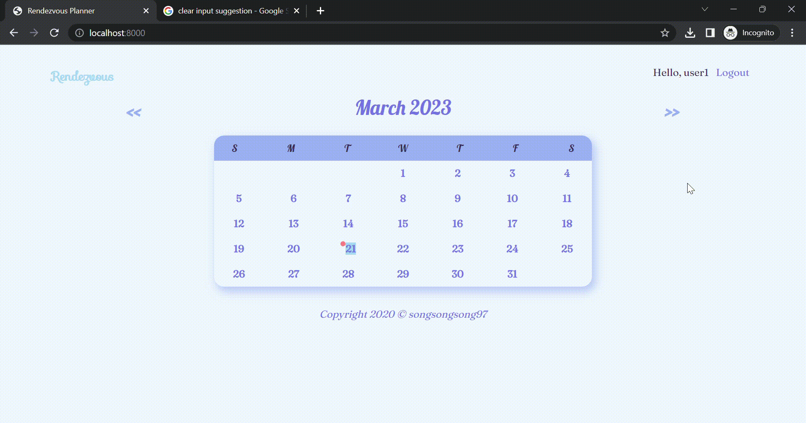

# Rendezvous Planner

With Rendezvous Planner, you can easily create to-do lists, plan your day ahead, and keep track of your daily expenses.

## Setup
```
pip install -r requirements.txt

python manage.py runserver
```

#### To create new superuser
Default admin credentials <br><br>
<b>username:</b> admin <br>
<b>password:</b> password
```
python manage.py createsuperuser
```

## Navigate to Admin Page
Navigate to http://localhost:8000/admin



## Demo
#### User Sign Up and Login


#### User Actions


#### View Montly Expenses Charts


